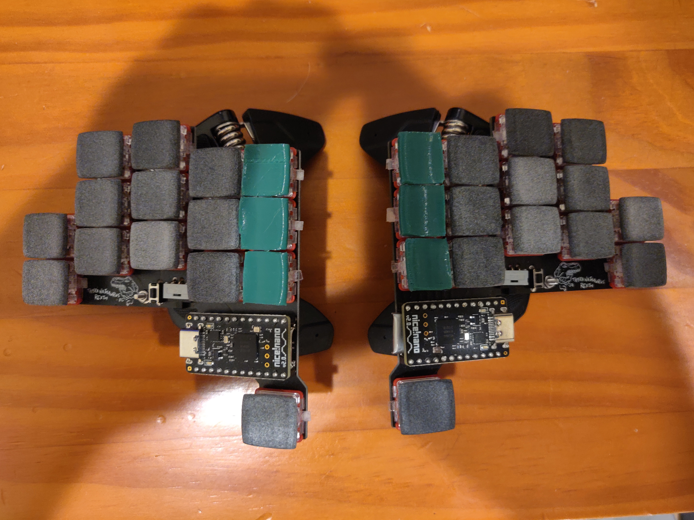

# Thyranathaurus Rexth 30

## About

- 30 keys
- Split keyboard
- Ortholinear
- Wireless
- Choc switch compatible
- Minimal spacing
- Tenting puck compatible

## Firmware

[Example zmk configuration](https://github.com/erhickey/keyboards/tree/main/t_rexth_30)

### Notes

This was my first attempt at building a custom keyboard, and has a couple issues:

- Attempting to solder battery wires onto the PCB without shorting your battery can be tricky.
- The spacing between the innermost columns is not wide enough, thus the philadelphia minimalist keycaps [do not fit both columns](./pics/choc30_single.jpg).

## Credits/Thanks

- Motivated by [Ben Vallack's videos](https://www.youtube.com/channel/UC4NNPgQ9sOkBjw6GlkgCylg)
- Created with [Ergogen v3](https://github.com/ergogen/ergogen)
- Lots of help from members of [Ergogen Discord](https://discord.gg/nbKcAZB)
